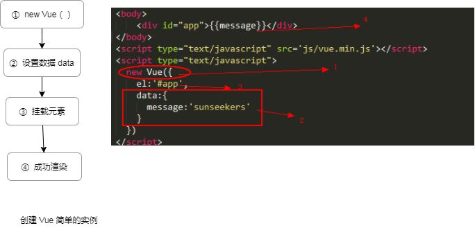
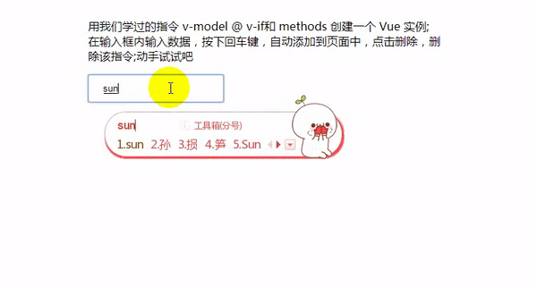
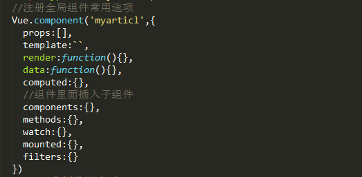
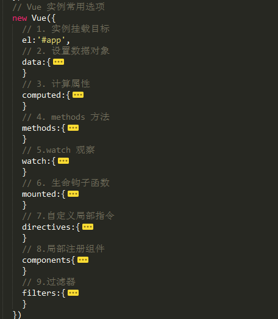

<h1 style='color:rgb(230,3,135);'>2018 我所了解的 Vue 知识大全</h1>
<i>年初第一个 flag 就是掌握 vue ，哈哈</i>

Vue ，React ，Angular 三大主流框架，最后我选择学习 Vue ，接触过 React ，自己感觉学习曲线有些陡峭，相比较之下我个人觉得 Vue 的学习曲线平稳很多，进而进一步学习；不管选择什么框架，除了对基础的知识有一定的了解掌握，还应该对 ES6 有一定的了解；

这就是我脑海中的 Vue 知识体系；

一句话概况了 Vue  <b>通过尽可能简单的 API 实现响应的数据绑定和组合的视图组件</b>;

<h2 style='color:rgb(230,3,135);'> Vue 的创建</h2>
一个简单的 Vue 实例只需要四步即可

我们的学习目的肯定不止于创建简单的 Vue 实例；而是用它去实现更加多变的功能需求；那我们需要进一步去学习 Vue-router 和 Vuex 以及 Vue-cli；

先说说基础的 Vue 吧，在创建了一个简单 Vue 实例之后，我们是否还能在实例中添加更加完善的数据选项，去完成我们多变的功能需求；答案是肯定能的；
 

 指令

<i>下面是我用 指令 写的一个小案例，刚好所有的指令都派上了用场</i>

[详细请看 demo 源码](https://github.com/sunseekers/Vue/blob/master/dome1.html)

<b> 自定义指令</b>

[查看代码源](https://github.com/sunseekers/Vue/blob/master/directive.html)

 Vue API

 Vue 组件

 Vue 实例

这就是我在学习 Vue 的时候，在 Vue 实例中添加的比较多的；<i> directives 和 components 在 Vue 实例中为创建的 <b>局部</b> 自定义指令和注册组件，Vue.directive() 和 Vue.component() 则是注册全局</i> 

 生命周期钩子

每个 Vue 实例在被创建之前都要经过一系列的初始化过程。例如需要设置数据监听、编译模板、挂载实例到 DOM、在数据变化时更新 DOM 等。同时在这个过程中也会运行一些叫做生命周期钩子的函数，给予用户机会在一些特定的场景下添加他们自己的代码。

在QQ群里看到一张生命周期图，我觉得写的特别好,感谢总结这张图的朋友

配合着实例代码效果更佳[查看代码源](https://github.com/sunseekers/Vue/blob/master/mounted.html)

生命周期钩子的函数简单说就是八个函数

<h2 style='color:rgb(230,3,135);'> 如何让 Vue 书写更佳优美？</h2>

[详细 style-guide 请参看官网](https://cn.vuejs.org/v2/style-guide/)

