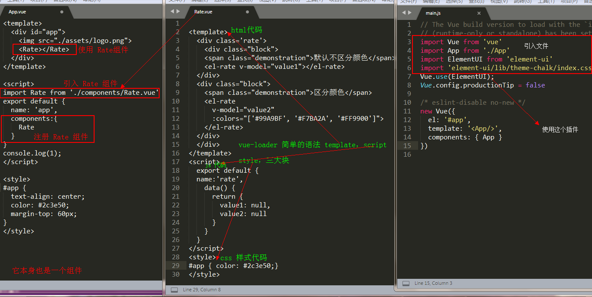

<h1 style='color:rgb(230,3,135);'>2018 我所了解的 Vue 知识大全 （二）</h1>

<i>在前面的一篇文章中还漏掉了几个，现在把它补全，我发现还是要多练习才行，对于语法还有 API 的了解才更加深刻，结合小 demo 看，所有的东西都变得通俗易懂啦</i>

接下来的目标是 vue-router 和 vuex 的学习；等到基本上 vue 的东西学的差不多,在把所有的知识点都理顺啦，就准备 <b>用 vue-cli 搭建一个网站进行学习，贯彻所有的知识</b>；来检验和巩固 vue 的学习成果

<h3 style='color:rgb(230,3,135);'> Key </h3>
<i>Vue 为了尽可能高效地渲染元素，通常会重复利用已有元素而不是从头开始渲染。这么做的目的是 Vue 变得非常快</i>


当我们在登录框输入内容之后，在切换到注册框的时候，发现账号和密码依然存在。不用重新输入，这就很好的的解释了 vue 是如何复用已有的元素的；

<i>被复用的组件实例,意味着组件的生命周期钩子不会再被调用。 我们可以用 watch（监测变化）来对响应做出变化</i>

[查看源码](https://github.com/sunseekers/Vue/blob/master/register.html)

如果我们不想复用已有的元素，即切换到注册的时候，清空账号和密码，那 <b> key </b>就派上用场了，在标签内加入 key="username-input" 和 key="username-password" ,就清除复用了，此时 Vue 元素就是重头开始渲染

[查看例子-> key 管理可复用元素](https://cn.vuejs.org/v2/guide/conditional.html) 

<span style='color:rgb(230,3,135);'> v-if </span>vs<span style='color:rgb(230,3,135);'> v-show </span>

v-show : 相当于 css 属性的 display ；适合频繁的切换

 v-if : 节点的增加和删除 ；适合条件很少改变时用

 v-for 具有比 v-if 更高的优先级。

<h3 style='color:rgb(230,3,135);'> Is 特性</h3>
在 vue 中，当使用 DOM 作为模板时，你会受到 HTML 的一些限制。像 ul 、ol、table、select 这样的元素里如果写入自定义组件将被当做无效内容，
例如：

```python
<table>
  <my-row>...</my-row>
</table>
//自定义组件 <my-row> 会被当作无效的内容
```
可是在实际项目中我们又会经常使用自定义组件，那该怎么办呐？？？

<b>is</b> 特性专为解决此问题，用 is 没 bug ；
```python
<table>
  <tr is="my-row"></tr>
</table>
//自定义组件 <my-row> 为有效的内容
```


[查看源码](https://github.com/sunseekers/Vue/blob/master/is.html)

自定义组件中父组件通过 props 属性将数据传递给子组件，反过来子组件通过 $emit( event, […args] )把数据发送到父组件，进而进行修改父组件的数据

[查看源码](https://github.com/sunseekers/Vue/blob/master/emit.html)

javaScript 中事件对象用 event ，vue 中事件对象用 $event

既然选择用库了，就全程用人家的东西，<b>属性绑定用 v-bind:(:),</b>写一些原生可以但是可能会报错


<h3 style='color:rgb(230,3,135);'> 动画 </h3>

动画简单说就是两种形式<b>出现动画（进入动画），消失动画（离开动画）</b>,配合第三方动画库如 animation.css 或者 Velocity.js 效果功能更好

transition 组件

```python
<transition>
    运动的东西(元素，属性，路由....)
</transition>
```
[transform 参考](https://cn.vuejs.org/v2/guide/transitions.html)
<h3 style='color:rgb(230,3,135);'> slot 插槽</h3>
slot: 作用就是占个位置；


有时候我们会遇到这样的情况？组件自身定义的会被 template 替换掉！！！可是我并不想它被替换掉，那要如何解决？？？？

前面说了 slot 的作用是占个位置，此刻 slot 就是解决问题的关键

我们只需要在 template 里面加个 slot 标签占个位置就好了


[源码地址]()

<h3 style='color:rgb(230,3,135);'> axios </h3>
在 vue2.0 中官方推荐使用 axios 做数据交互；不在推荐使用以前的 vue-resourse ；其实做交互她们本质上是一样的 vue-resourse 怎么用， axios 也可以那样用；


[详情请参考axios](https://github.com/axios/axios)

<h3 style='color:rgb(230,3,135);'> vue-cli 目录结构 </h3>
上面我采用的是 vue-cli 手脚架搭的； 用axios 实现数据交互，vue-cli 搭建的教程挺多的流程也简单，我就不去详细介绍啦！vue-cli 是基于 webpack 构建， vue-loader 能够解析 后缀名 .vue ; 在用 vue-cli 的时候我们用的比较多； 


[vue-loader](https://vue-loader.vuejs.org/zh-cn/)

[vue-cli](https://github.com/vuejs/vue-cli)

<span style='color:rgb(230,3,135);'> vue-cli 目录结构 </span>

```python
|-- build                            // 项目构建(webpack)相关代码
|   |-- build.js                     // 生产环境构建代码
|   |-- check-version.js             // 检查node、npm等版本
|   |-- dev-client.js                // 热重载相关
|   |-- dev-server.js                // 构建本地服务器
|   |-- utils.js                     // 构建工具相关
|   |-- vue-loader.conf.js           // vue-loader基础配置
|   |-- webpack.base.conf.js         // webpack基础配置
|   |-- webpack.dev.conf.js          // webpack开发环境配置
|   |-- webpack.prod.conf.js         // webpack生产环境配置
|-- config                           // 项目开发环境配置
|   |-- dev.env.js                   // 开发环境变量
|   |-- index.js                     // 项目一些配置变量
|   |-- prod.env.js                  // 生产环境变量
|   |-- test.env.js                  // 测试环境变量
|-- node_modules                     // 存放 npm 下载的模块
|-- src   这是我们经常会用的一个文件夹  // 源码目录
|   |-- assets                     // 存放静态资源文件会被webpack处理解析为模块依赖
|   |-- components                     // vue公共组件
|   |-- store                          // vuex的状态管理
|   |-- router                         // 路由管理文件
|   |-- App.vue                        // 页面入口文件
|   |-- main.js                        // 程序入口文件，加载各种公共组件
|-- static                           // 静态文件，比如一些图片，json数据等
|-- test                             // 测试文件
|-- .babelrc                         // ES6语法编译配置
|-- .editorconfig                    // 定义代码格式
|-- .gitignore                       // git上传需要忽略的文件格式
|-- README.md                        // 项目说明
|-- favicon.ico 
|-- index.html                       // 入口页面
|-- package.json                     // 项目基本信息

static放不会变动的文件 assets放可能会变动的文件。
```
用 vue-cli 构建一个简单的页面很简单，这就是一个简单的 vue-cli 构建的文件；



上面引入了 <b>饿了么写的 ElementUI 组件</b>，和在一个组件里面引用了另一个组件然后在渲染到页面中去

[vue-cli]()主要看 src 里面的内容


