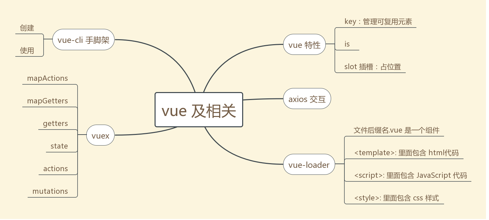
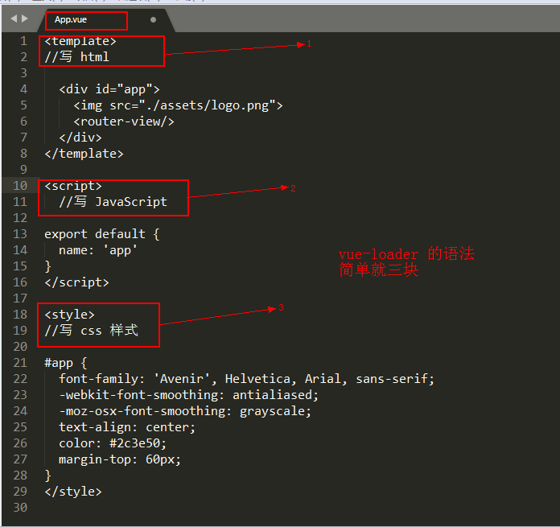
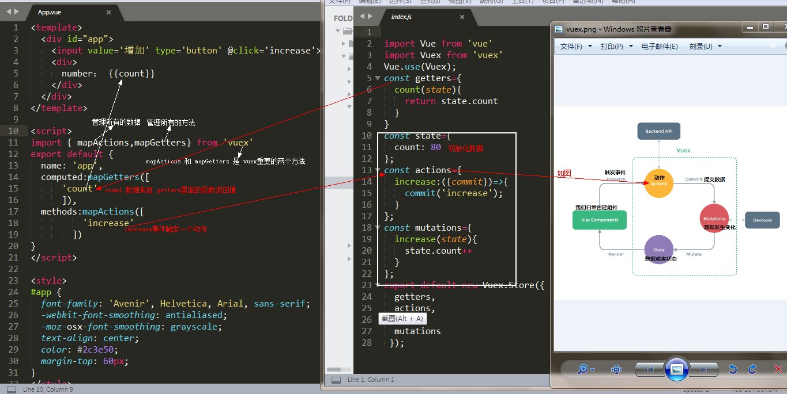

<h1 style='color:rgb(230,3,135);'>2018 我所了解的 Vue 知识大全 （二）</h1>

<i>在前面的一篇文章中 vue 还漏掉了几个特殊的特性，现在把它补全。然后再补充一些关于 vue-cli ，vue-loader，vuex，axios 的简单知识； vue-router 的相关知识我准备在另外写一篇文章。以防文章太长，留点空白，哈哈哈哈</i>

去年 12 月份开始接触 vue ，到现在我发现真的要多练习，对于语法和 API 的了解才更加深刻，结合小 demo 看，所有的东西都变得通俗易懂啦。请相信，**语言只是一种工具，核心依旧是编程思想**，所以学习并不难

接下来的目标是把所有的知识点都理顺，然后**准备用 vue-cli 搭建一个网站进行学习，贯彻所有的知识**；来检验和巩固 vue 的学习成果。

在学习这篇文章之前，我假设你已经对 vue 有了一定的了解，如果没有请你先看看 [官方文档](https://cn.vuejs.org/v2/guide/)，或者退而求其次看看我之前的文章 [2018 我所了解的 Vue 知识大全（一）](https://zhuanlan.zhihu.com/p/32564918)；哈哈哈哈，这只是我所理解了解的 vue 及相关知识，欢迎大家和我一起学习交流，共同学习进步，指出我的问题
## vue相关特性 

<h3 style='color:rgb(230,3,135);'> Key </h3>
<i>Vue 为了尽可能高效地渲染元素，通常会重复利用已有元素而不是从头开始渲染。这么做的目的是 Vue 变得非常快</i>


当我们在登录框输入内容之后，在切换到注册框的时候，发现账号和密码依然存在。不用重新输入，这就很好的的解释了 vue 是如何复用已有的元素的；

<i>被复用的组件实例,意味着组件的生命周期钩子不会再被调用。 我们可以用 watch（监测变化）来对响应做出变化</i>

[查看源码](https://github.com/sunseekers/Vue/blob/master/register.html)

如果我们不想复用已有的元素，即切换到注册的时候，清空账号和密码，那 <b> key </b>就派上用场了，在标签内加入 key="username-input" 和 key="username-password" ,就清除复用了，此时 Vue 元素就是重头开始渲染

[查看例子-> key 管理可复用元素](https://cn.vuejs.org/v2/guide/conditional.html) 

<span style='color:rgb(230,3,135);'> v-if </span>vs<span style='color:rgb(230,3,135);'> v-show </span>

v-show : 相当于 css 属性的 display ；适合频繁的切换

 v-if : 节点的增加和删除 ；适合条件很少改变时用

 v-for 具有比 v-if 更高的优先级。

<h3 style='color:rgb(230,3,135);'> is 特性</h3>
在 vue 中，当使用 DOM 作为模板时，你会受到 HTML 的一些限制。像 ul 、ol、table、select 这样的元素里如果写入自定义组件将被当做无效内容，
例如：

```python
<table>
  <my-row>...</my-row>
</table>
//自定义组件 <my-row> 会被当作无效的内容
```
可是在实际项目中我们又会经常使用自定义组件，那该怎么办呐？？？

<b>is</b> 特性专为解决此问题，用 is 没 bug ；
```python
<table>
  <tr is="my-row"></tr>
</table>
//自定义组件 <my-row> 为有效的内容
```


[查看源码](https://github.com/sunseekers/Vue/blob/master/is.html)

自定义组件中父组件通过 props 属性将数据传递给子组件，反过来子组件通过 $emit( event, […args] )把数据发送到父组件，进而进行修改父组件的数据

[查看源码](https://github.com/sunseekers/Vue/blob/master/emit.html)

javaScript 中事件对象用 event ，vue 中事件对象用 $event

<h3 style='color:rgb(230,3,135);'> 动画 </h3>

动画简单说就是两种形式<b>出现动画（进入动画），消失动画（离开动画）</b>,配合第三方动画库如 animation.css 或者 Velocity.js 效果功能更好

transition 组件

```python
<transition>
    运动的东西(元素，属性，路由....)
</transition>
```
[transform 参考](https://cn.vuejs.org/v2/guide/transitions.html)
<h3 style='color:rgb(230,3,135);'> slot 插槽</h3>
slot: 作用就是占个位置；


有时候我们会遇到这样的情况？组件自身定义的会被 template 替换掉！！！可是我并不想它被替换掉，那要如何解决？？？？

前面说了 slot 的作用是占个位置，此刻 slot 就是解决问题的关键

我们只需要在 template 里面加个 slot 标签占个位置就好了


[源码地址](https://github.com/sunseekers/Vue/blob/master/slot.html)

<h2 style='color:rgb(230,3,135);'> axios </h2>
在 vue2.0 中官方推荐使用 axios 做数据交互；不在推荐使用以前的 vue-resourse ；其实做交互她们本质上是一样的 vue-resourse 怎么用， axios 也可以那样用；


上面我采用的是 vue-cli 手脚架搭的； 用 axios 实现数据交互
[详情请参考axios](https://github.com/axios/axios)

<h3 style='color:rgb(230,3,135);'> vue-cli 目录结构 </h3>
关于如果创建一个 vue-cli 我就简单介绍了，假设你已经安装了 node.js 和 npm 包管理器
1. 安装webpack

 `npm install webpack -g`
 
2. 安装vue脚手架

 `npm install vue-cli -g`
 
3. 初始化，生成项目模板（projectname是项目名，自己随意）

   `vue init webpack projectname`
   
4. 运行 

   `npm run dev`

<span style='color:rgb(230,3,135);'> vue-cli 目录结构 </span>

```python
|-- build                            // 项目构建(webpack)相关代码
|   |-- build.js                     // 生产环境构建代码
|   |-- check-version.js             // 检查node、npm等版本
|   |-- dev-client.js                // 热重载相关
|   |-- dev-server.js                // 构建本地服务器
|   |-- utils.js                     // 构建工具相关
|   |-- vue-loader.conf.js           // vue-loader基础配置
|   |-- webpack.base.conf.js         // webpack基础配置
|   |-- webpack.dev.conf.js          // webpack开发环境配置
|   |-- webpack.prod.conf.js         // webpack生产环境配置
|-- config                           // 项目开发环境配置
|   |-- dev.env.js                   // 开发环境变量
|   |-- index.js                     // 项目一些配置变量
|   |-- prod.env.js                  // 生产环境变量
|   |-- test.env.js                  // 测试环境变量
|-- node_modules                     // 存放 npm 下载的模块
|-- src   这是我们经常会用的一个文件夹  // 源码目录
|   |-- assets                     // 存放静态资源文件会被webpack处理解析为模块依赖
|   |-- components                     // vue公共组件
|   |-- store                          // vuex的状态管理
|   |-- router                         // 路由管理文件
|   |-- App.vue                        // 页面入口文件
|   |-- main.js                        // 程序入口文件，加载各种公共组件
|-- static                           // 静态文件，比如一些图片，json数据等
|-- test                             // 测试文件
|-- .babelrc                         // ES6语法编译配置
|-- .editorconfig                    // 定义代码格式
|-- .gitignore                       // git上传需要忽略的文件格式
|-- README.md                        // 项目说明
|-- favicon.ico 
|-- index.html                       // 入口页面
|-- package.json                     // 项目基本信息

static放不会变动的文件 assets放可能会变动的文件。
```

好了我们用  vue-cli 就已经创建了一个简单的小项目了；运行看看吧！接下来我们只需要去 src 文件里面创建我们需要的文件就好了，是不是很简单呀！！！！

*注意: vue-cli 是基于 webpack 构建， 如果你知道 webpack 这就很简单了，如果你不懂，这也不难；vue-loader 能够解析 后缀名 .vue ; 而用 vue-cli 的时候我们使用比较多的后缀名 .vue；以后缀名  .vue 结尾的表示一个组件，其中采用了 ES6语法* 



上面是我写的一个小demo，其中引入了 <b>饿了么写的 ElementUI 组件</b>，和在一个组件里面引用了另一个组件然后在渲染到页面中去

[动手 试试 vue-cli 案例 主要看 src 里面的内容](https://github.com/sunseekers/Vue/tree/master/online)

[vue-loader 文档](https://vue-loader.vuejs.org/zh-cn/)

[vue-cli 文档](https://github.com/vuejs/vue-cli)

## vuex
vuex 是什么？

文档解释说 vuex 是一个专门为 Vue.js 应用程序开发的 <b>状态管理模式</b>；
每一个 Vuex 应用的核心就是 <b>store</b>(仓库)，包含着我们应用中大部分的状态；

我的理解就是集中管理数据；一个可以观看 vue 每一次状态变化的东西，和 git 仓库有那么一点点类似；不直接改变 store 的状态，而是要通过 commit 显示的提交到 mutation


vuex 提供两个特别有用的方法

**mapActions**  管理所有事件的行为；打包的处理所有actions的一个方法，里面传入处理的事件，是一个数组；放在 methods 中就好了

 **mapGetters**  把 getters 获取的数据映射到此；放在computed 里面

1. getters ：获取到数据，然后映射到 mapGetters 中，然后可在组件中直接引入

2. state ：数据初始化，或者说组件中需要的数据

3. actions： 处理你要干什么，异步请求，判断，或者流程控制，通过 commit 提交到 mutations

4. mutations： 处理 commit 的请求，使数据或者状态的变化
 
看起来，说起来，好像有点枯燥，不是特别能够理解，看看图和代码，结合 源码，然后自己在试着修改，添加一些东西，应该就好懂了；
 

 
 [代码地址](https://github.com/sunseekers/Vue/tree/master/online/vuexsrc/src)
 
 [详情请参考文档](https://vuex.vuejs.org/zh-cn/installation.html)
 
> 个人建议：既然选择用库了，就全程用人家的东西，<b>属性绑定用 v-bind:(:),</b>写一些原生可以但是可能会报错

最后在插播一条小小广告，哈哈！我是 18 级应届毕业生，目前正在找 web前端工作，有合适的求推荐 ，感谢了!!
[附上简历](http://cv.qiaobutang.com/r/59325bbf0cf2c326adc0f57c)


