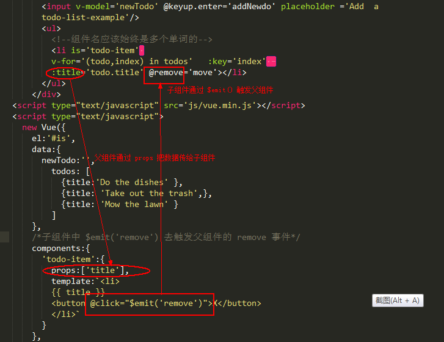

<h1 style='color:rgb(230,3,135);'>2018 我所了解的 Vue 知识大全 补漏（二）</h1>
<h3 style='color:rgb(230,3,135);'> Key </h3>
<i>Vue 为了尽可能高效地渲染元素，通常会重复利用已有元素而不是从头开始渲染。这么做的目的是 Vue 变得非常快</i>


当我们在登录框输入内容之后，在切换到注册框的时候，发现账号和密码依然存在。这就很好的的解释了 vue 是如何复用已有的元素的；

[查看源码]()

如果我们不想复用已有的元素，即切换到注册的时候，清空账号和密码，那 <b> key </b>就派上用场了，在标签内加入 key="username-input" 和 key="username-password" ,就清除复用了，此时 Vue 元素就是重头开始渲染

[查看例子-> key 管理可复用元素](https://cn.vuejs.org/v2/guide/conditional.html) 

<span style='color:rgb(230,3,135);'> v-if </span>vs<span style='color:rgb(230,3,135);'> v-show </span>

v-show : 相当于 css 属性的 display ；适合频繁的切换

 v-if : 是真正的条件渲染 ；适合条件很少改变时用

 v-for 具有比 v-if 更高的优先级。

<h3 style='color:rgb(230,3,135);'> Is 特性</h3>
在 vue 中，当使用 DOM 作为模板时，你会受到 HTML 的一些限制。像 ul 、ol、table、select 这样的元素里如果写入自定义组件将被当做无效内容，
例如：

```python
<table>
  <my-row>...</my-row>
</table>
//自定义组件 <my-row> 会被当作无效的内容
```
可是在实际项目中我们又会经常使用自定义组件，那该怎么办呐？？？

<b>is</b> 特性专为解决此问题，用 is 没 bug ；
```python
<table>
  <tr is="my-row"></tr>
</table>
//自定义组件 <my-row> 为有效的内容
```
自定义组件中父组件通过 props 属性将数据传递给子组件，反过来子组件通过 $emit('event') 触发父组件，进而进行修改父组件的数据



[查看源码]()