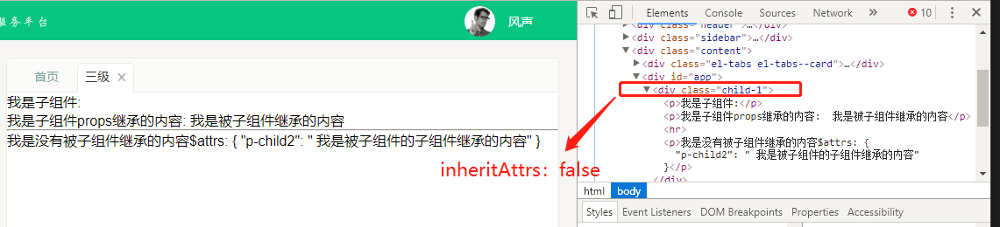
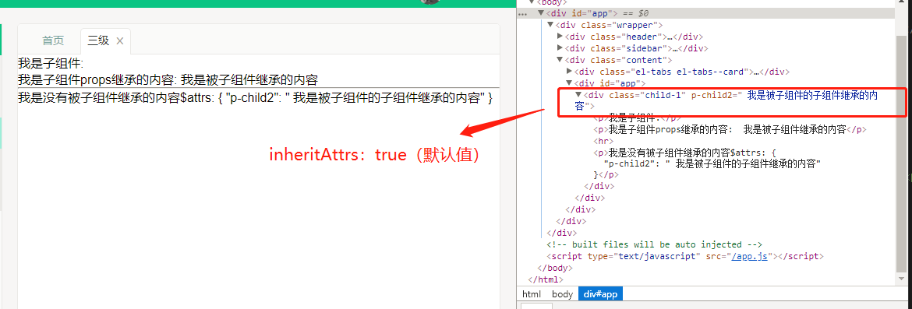
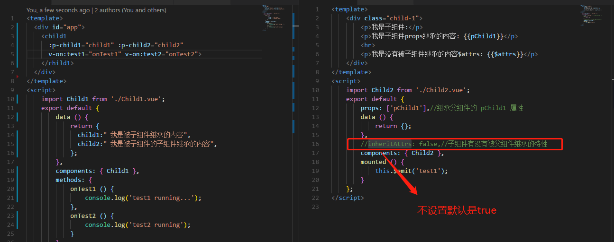
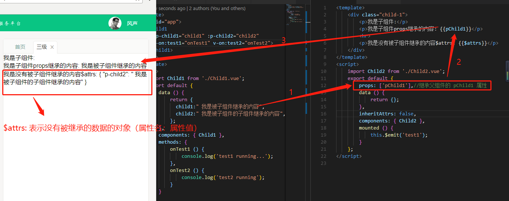

# Vue 父子组件数据传递的另一种方式
当我们在书写 `vue` 组件的时候，也许可能会用到数据传递；将父组件的数据传递给子组件，有时候也需要通过子组件去事件去触发父组件的事件；

每当我们遇到这样的需求的时候，我们总是会想到有三种解决办法：

1. 通过 `props` 的方式向子组件传递(父子组件)

2. `vuex` 进行状态管理(父子组件和非父子组件)

3. 非父子组件的通信传递 `Vue Event Bus`，使用Vue的实例，实现事件的监听和发布，实现组件之间的传递。

后来再逛社区的时候我又发现了还有第四种传递方式，`inheritAttrs` + `$attrs` + `$listeners` 

附上原文链接[Vue2.4版本中新添加的$attrs以及$listeners属性使用](http://www.monster1935.site/2017/07/26/Vue2.4%E6%96%B0%E5%A2%9E%E5%B1%9E%E6%80%A7%E8%A7%A3%E6%9E%90/) 和 [Vue.js最佳实践（五招让你成为Vue.js大师）](https://mp.weixin.qq.com/s/cVYtYWOB2mie-bjZmSw9AQ)

基本是大部分的公司或者项目都是用前面两种，我司也不例外；好像曾经在官方文档看到过，`vuex` 适合用在大型的项目中。第三种方式我曾在我的毕设中用到过，其他地方我好像目前是没有看到，当时只有一个功能需要在兄弟组件之间传递数据，用 `vuex` 的话，大材小用，另外还需要时间成本。所以我选择了`Vue Event Bus`；最后一种方式的话，我目前还没有看到过在项目的应用。但是我个人觉得既然有这个 `api` 那肯定是有他存在的道理。不然它存在还有何意义的？？如果有需求我个人觉得可以尝试用一用；拥抱变化，拥抱机会

工作之后发现，碰到 `bug` 有时候常规的方式，并不一定是最好的。跳出常规思维，跳出常规方式去解决问题，可能会更加好。常规方法能够解决问题但是未免有些臃肿。在实践的采坑中体会更有意思

##  `inheritAttrs` + `$attrs` +  `$listeners`

> `inheritAttrs` ：默认是 `true`

我的解释就是：没有被子组件继承的父组件属性，不会当做特性展示在子组件根元素上面。说起来，听起来好像有些拗口，看截图看代码你就明白了

`inheritAttrs :false`

`inheritAttrs :false`

官方解释：默认情况下父作用域的不被认作 `props` 的特性绑定 (`attribute bindings`) 将会“回退”且作为普通的 `HTML` 特性应用在子组件的根元素上。当撰写包裹一个目标元素或另一个组件的组件时，这可能不会总是符合预期行为。通过设置 `inheritAttrs`到 `false`，这些默认行为将会被去掉。而通过 (同样是 2.4 新增的) 实例属性 `$attrs` 可以让这些特性生效，且可以通过 `v-bind` 显性的绑定到非根元素上。

> `$attrs`

我的解释就是：存放没有被子组件继承的的数据对象；看看图

官方文档解释：包含了父作用域中不作为 prop 被识别 (且获取) 的特性绑定 (class 和 style 除外)。当一个组件没有声明任何 prop 时，这里会包含所有父作用域的绑定 (class 和 style 除外)，并且可以通过 v-bind="$attrs" 传入内部组件——在创建高级别的组件时非常有用。

> `$listeners`

我的理解就是：子组件可以触发父组件的事件（不需要用什么那些麻烦的vuex或者一个空的 `Vue` 实例作为事件总线，或者又是什么`vm.$on` )

官方文档解释：包含了父作用域中的 (不含 .native 修饰器的) v-on 事件监听器。它可以通过 v-on="$listeners" 传入内部组件——在创建更高层次的组件时非常有用。

后续补上例子

