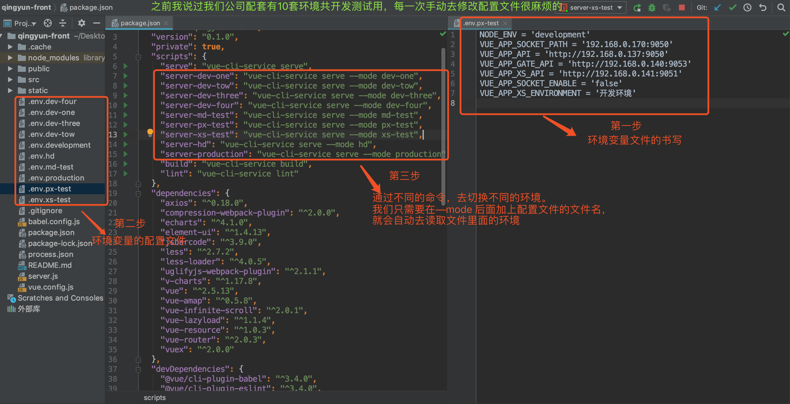
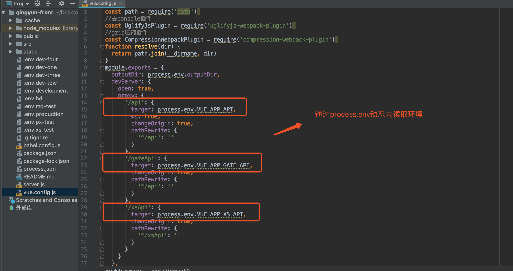
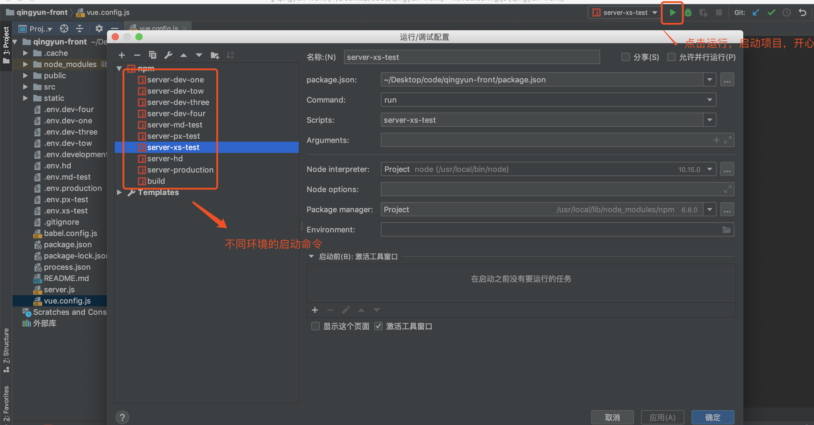
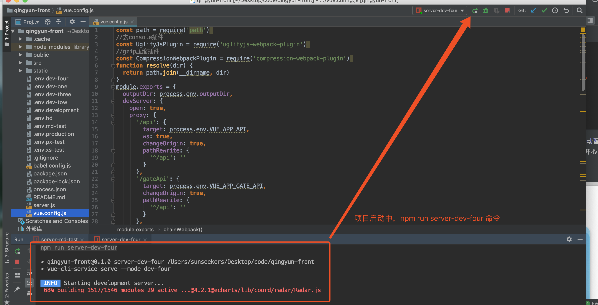
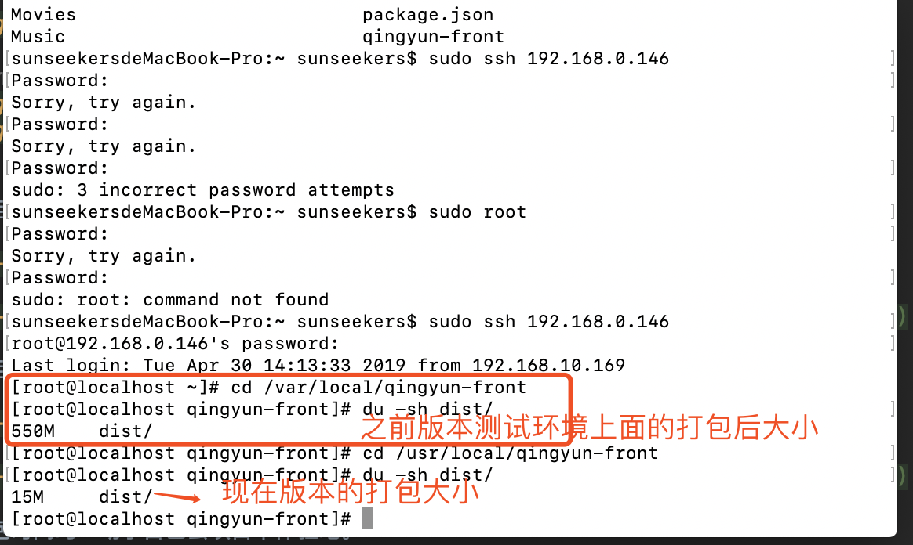
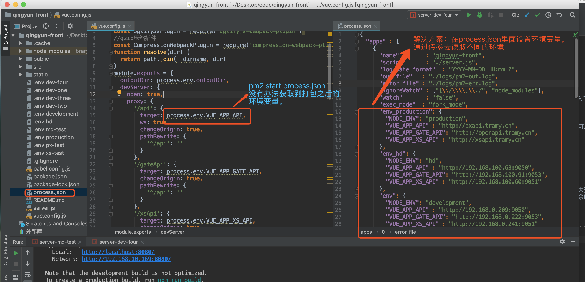
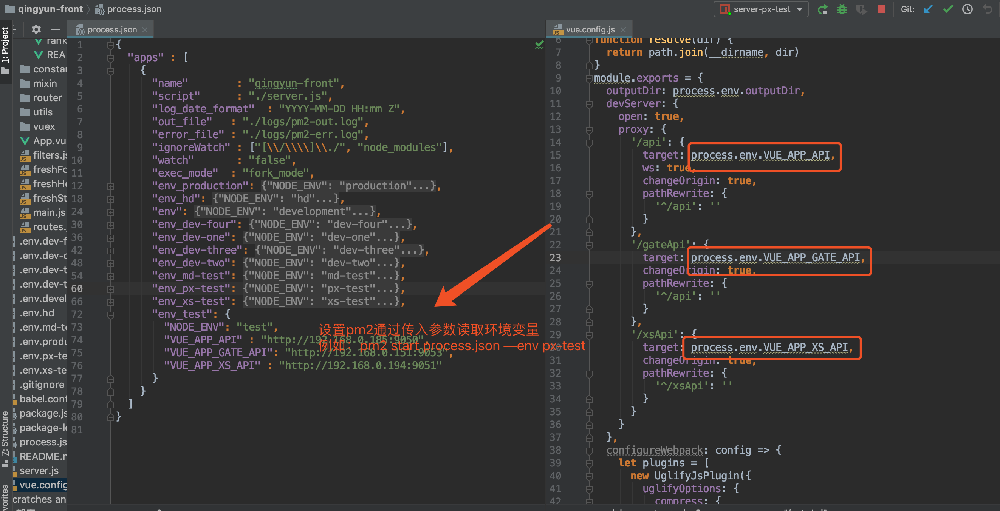

# vue cli 3.0 迁移项目（下）

用公司的小项目，小小尝试之后，效果体验还不错。半年后鼓起勇气向领导谈及公司核心项目升级。领导说小小个个，胆子不小嘛。有这股劲，以后是个干大事的人。

我领导是个 `java` ，前端并不是他的拿手项目，很多时候他只能给我提供一个思想，实践需要我自己。慢慢自己去啃文档，慢慢踩坑，慢慢成长。

## 为什么要使用 `vue cli 3.0` 搭建项目？

为了更好的开发体验，提高开发效率，更好的了解项目。
之前写过一篇 [`vue cli 3.0 迁移项目（上)`](https://github.com/sunseekers/Vue/blob/master/vue-cli(%E4%B8%80%EF%BC%89.md) 的文章，比较了相关的性能，和配置文件。
这次讲讲项目迁移的具体操作

## 老项目是  `vue cli 2.0`， 如何转到 `vue cli 3.0` 有没有风险？

我只知道项目平行迁移，搭建一个项目，然后把代码搬过去。风险和机遇共存，鼓起勇气向推动公司核心项目发展，很慌也很害怕。但是短暂的害怕可以换取长期极致的技术体验，加深对项目了解
，在推动技术的同时成长自己。稳赚不赔的买卖，任何时刻不要因为害怕而不去尝试。

## 有什么优缺点？

我司有四个后端研发团队，每个后端团队的都在不同的环境下进行开发，测试还有测试环境。各种环境算下来有10个，前端每一次在不同的环境下开发
都要去改配置文件。每次都是手动去改环境，很麻烦的。

之前的项目切换不同的环境，都是去 `config/index.js` 里面修改

解决方案：`vue cli 2.0` 的手脚架应该也是可以实现的，只是没有必要了。已经推进 `vue cli 3.0`了，他构建的项目整体更加简洁，我更加喜欢。
 实现了不同的命令行运行不同的环境也很方便，再也不要手动去修改配置文件了。

第一步设置环境变量和命令行

第二步配置文件里面读取环境变量

我用的是 `webstorm` 开发工具，借助工具命令自动配置，一键启动环境，再也不用手动输入了，哈哈哈，开心

项目大小和打包之后的大小，为了减少误差，这一次我上测试服务器看，没有在本地看了，不可思议的结果。

想知道运行速度，打包时间吗？动手自己去项目中体验吧。

## 使用场景怎么样?
不管是新项目还是老项目都适合，没有任何门槛。但是要注意的是，相关插件的升级和迁移。去遇见问题，去解决问题。多看文档，如果文档解决不了就去`issue` 上面看看。
如果有解决不了的问题，那肯定是给的时间不够。整个升级都是我一个在负责的，利用的是业余时间，耗时有点久，请相信时间能解决很多问题的

## 踩坑小记

1. `pm2` 支持读取环境变量

这一次入坑主要是在 `pm2` ，因为之前不了解，这次踩坑花的时间特别长。一直 `console.log()` 把日志给打出来，去定位问题，一直 `console.log` 累死我了。哈哈

问题： 我们是通过 `pm2 start process.json` 命令启动项目的。

因为 `pm2` 运行的是打包之后的一堆 `js` 文件，所以是没有办法读取到打包之前的环境变量。这个问题可难道我了，想着 `pm2` 启动项目可以传入参数，那我是不是
可以通过传入参数给他去添加类似于环境变量的字符串。抱着是马当活马医试一试，结果成功了，笑死我了，开心的像个孩子

解决问题之后才发现原来这么简单，以后通过 `pm2 start process.json --env prodution` `pm2 start process.json --env hd` ...就切换环境了。一次打包就够了，解决了多次打包的问题。
，因为之前小项目的环境变量是写死的，没有通过环境变量去读取，所以没有遇到问题。

这一次踩坑事件，设想以后在前端项目中加入 `log4j` ，可以实时监控错误日志，并且可以输出到指定文件。未来会尝试使用，好像人家公司都是有的。

2. 项目中读取 `static` 文件失效

`assets` 和 `static` 文件夹的区别

两个放置静态资源的地方，分别是 `src/assets` 文件夹和 `static` 文件夹,这两者的区别很多人可能不太清楚，我就是其中一个。
`assets` 目录中的文件会被 `webpack` 处理解析为模块依赖，只支持相对路径形式。例如，在 `` 和 `background: url(./logo.png)` 中，`"./logo.png"` 是相对的资源路径，将由 `Webpack` 解析为模块依赖。
`static/` 目录下的文件并不会被 `Webpack` 处理：它们会直接被复制到最终的打包目录（默认是 `dist/static` ）下。必须使用绝对路径引用这些文件，这是通过在 `config.js` 文件中的 `build.assetsPublicPath` 和 `build.assetsSubDirectory` 连接来确定的。

简单说就是如果在项目中引入 `static/` 里面的文件通过 `require()` 进行引入。例如 `require('../../../../static/img/ditu.jpg')` 或者直接把 `static` 文件放到 `public` 地下。因为之前版本打包的时候 `static` 里面的文件是不会打包进去的。
升级之后的版本 `pubilc` 里面的文件是不会打包的。简单粗暴的解决就是 `static` 引入有问题，那我就 不打包 `static` 。哈哈，如果你们有更好的方法可以拿出来一起讨论呀

关于 `vue cli 3.0` 构建项目，或者迁移项目，最终还是要在是实际的项目开发中体验。每一个项目的实际情况都不一样，能去解决复杂的实际情况，才是关键所在。

关于升级到 `vue cli 3.0`，现在在测试阶段，离上线的时间越来越近。或许还有不可预见的困难等待我去解决，一直秉持着去遇见问题，然后在解决他。
推动这次项目升级总体来说，学到了很多东西。

抽象的：

如何快速定位到问题，然后如何有效的解决问题？

项目在服务器上如何运行？

后端能实现，能解决的，前端也是可以的，需要不断的尝试？

技术得到了沉淀

具体的：

`pm2` 命令，`Linux` 命令

上公司服务器去看日志，修改查看项目想过信息

对公司项目了解程度上升了一个等级（如果不了解，怎么敢提出升级）

