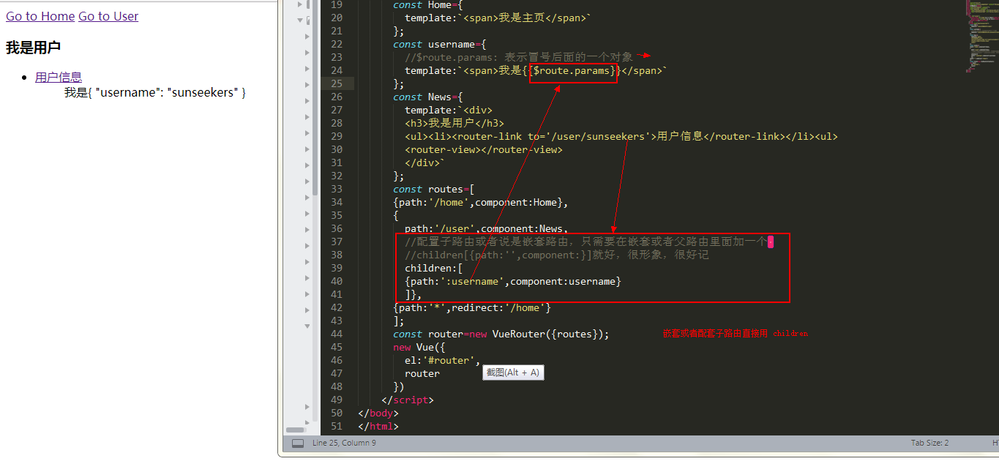
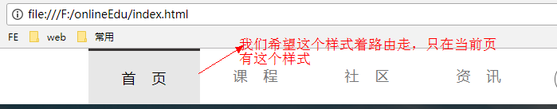

<h1 style='color:rgb(230,3,135);'>2018 我所了解的 vue-router </h1>


[查看原图](http://naotu.baidu.com/file/dbba90268bf1e5c34bfd39eaad721999?token=b39c89bd85d74046)

<i> `vue-router` : 简称路由，简单说就是根据不同的 url 地址，显示不同的效果</i>

`<router-link>`: 组件用于帮助用户进行<span style='color:rgb(230,3,135);'> 导航 </span>，也就是我们传统的 a 标签经常做的事；a 的标签用 href 属性来指定导航的目标地址，而  router-link 组件则用 to 属性来定目标地址；

`<router-view>` : </span>是路由的出口，路由匹配到的组件将<span style='color:rgb(230,3,135);'> 渲染 </span>在这里,即渲染 `<router-link>`指向的目标地址。


同一个路径可以匹配多个路由，匹配的优先级就按照路由的定义顺序：谁先定义的，谁的优先级就最高。

## 创建简单的 vue-router


 `<router-link>` 和 `<router-view>`  不必成双对的出现，可根据配置的不同路由渲染到一个 `<router-view>`

```
<div id='router'>
  <router-link to='/home'>Go to Home</router-link>
  <router-link to='/new'>Go to New</router-link>
  <router-view></router-view>
</div>
//JavaScript 代码
//1.创建组件
 const Home={
    template:`<span>我是主页</span>`
  };
  const News={
    template:`<span>我是新闻</span>`
  };
//2.配置路由
  const routersname=[
	{
    path:'/home',component:Home
  },
	{
    	path:'/new',component:News
  },
	//重定向
	{
  	path:'*',redirect:'/home'
	}];
//3.生成路由实例
 const router=new VueRouter({
  routes:routersname
  //此时 routers 和 routername 并不相等，所以不能在采用 es6 里面对象的简写方法
  });
  new Vue({
  	el:'#router',
  	router
  })
```
注意：在创建路由实例的时候应该知道其中使用了 ES6 对象里面简洁的语法；即**在 ES6 中只写属性名不写属性值时，属性值就代表属性名所代表的变量**
```
const router = new VueRouter({
  routes  // （缩写）相当于 routes: routes 是 ES6 对象里面简洁的语法
})
```
当然我们也可以不采用简写，自己随便配置,还是刚刚那个例子

```
//2.配置路由
const routersname=[
  { path:'/home',component:Home },
  { path:'/new',component:News },
    //重定向
  { path:'/new',component:News },
];
//3.生成路由实例
const router=new VueRouter({
  routes:routersname
//此时 routers 和 routername 并不相等
//所以不能在采用 es6 里面对象的简写方法
});
```
所以 router 后面的属性值应该始终和配置路由时候的变量一样

[查看源码](https://github.com/sunseekers/Vue/blob/master/vue-router.html)

## 嵌套的 vue-router 
实际生活中的我们经常会遇到 多层嵌套的组件组合而成，URL 中各段动态路径也按某种结构对应嵌套的各层组件

这时候我们怎么办呐？

其实嵌套路由很简单，只需要加上一个 children 就好，children 里面的写法和外面的一样



$route.params： 表示当前的参数即冒号后面的东西

/detail/:id/age/:age  --->$route.params 表示  id 和 age 组成的对象

[查看源码](https://github.com/sunseekers/Vue/blob/master/vue-router2.html)

## 路由的两种实例方法 

> router.push({path:'/home'}): 直接添加一个路由，表现为切换路由，往历史记录里面添加一个历史记录

> router.replace({path:'news'}): 替换路由，历史记录里面没有添加记录


引入了过渡动画 ，顺便可以温习一下 transform 组件的知识，页面效果看起来好看多了，哈哈哈哈

[查看源码](https://github.com/sunseekers/Vue/blob/master/routerTransform.html)

## 配置路由的模式
设置路由的跳转方式

mode 表示路由的配置模式:两种

> 1. hash模式（默认）:使用 URL 的 hash 来模拟一个完整的 URL，于是当 URL 改变时，**页面不会重新加载**。

> 2. history模式: 通过history完成 URL **跳转而无须重新加载页面**。

```
//创建路由实例
const router = new VueRouter({
  mode: 'history',//跳转而无须重新加载页面
  routes
})
```


## 路由的滚动 scrollBehavior
不知道你们有没有遇到过这样的情况？

1. 当切换到新路由时，我想要想要页面滚到顶部！！！

2. 当切换到新路由时，保持原先的滚动位置！！！！

3. 当切换到新路由时，我想随意定位！！！！

这时候该怎么办？？？

告诉你 **vue-router** 能做到，而且很很好，它让你可以自定义路由切换时页面如何滚动。
```
const router = new VueRouter({
  routes,
  scrollBehavior (to, from, savedPosition) {
    // return 期望滚动到哪个的位置
     return {x:0,y:0} //对于所有路由导航，简单地让页面滚动到顶部
  }
})
```
## 路由监听 watch
在 vue 中 watch 用来监听当一个数据属性值发送变化时，就可以调用的函数；属于异步操作；一般情况下，我们建议用 computed 或者 menthods 代替。对于大型的应用我们就建议使用 watch；

关于 mothds, computed, watch 三者的具体区别，推荐看大漠老师写的[在Vue中何时使用方法、计算属性或观察者](https://www.w3cplus.com/vue/when-to-use-methods-computed-properties-or-watchers.html)

回到 vue-router ，当我们切换路由的时候，希望某些属性也跟着路由变化；例如

这时候我们就可以用 watch 来监听路由,当路由发生变化时,相对于的样式也跟着显示或隐藏；这只是一个很简单的例子


## `<router-link>` 属性

> 1. to ：相当于 a 的标签用 href 属性，来指定导航的目标地址；

导航的目标地址的几种写法
```
  1.字符串表示
  <router-link to='Home'>Home</router-link>

  2.v-bind 绑定属性
  <router-link :to='Home'>Home</router-link>

  3.对象表示
  <router-link :to="{path:'Home'}">Home</router-link>

  4.命名的路由
  <router-link :to="{name:'Home',params:{home:123}}">Home</router-link>

  5.带查询参数，下面的结果为 /Home?plan=private
  <router-link :to="{path: 'Home', query: { plan: 'private' }}">Home</router-link>
```
我们常用前两种方法

>  2. replace

   `<router-link to='Home' replace>Home</router-link>`
   给它设置了 replace 属性， 会调用 router.replace() 而不是 router.push()，于是导航后不会留下 history 记录。详情请看上面 router.replace 和 router.push() 的区别

>  3. 设置 tag 就会把 `<router-link>` 渲染成某种标签
 ```
<router-link to="/foo" tag="li">foo</router-link>
   <!-- 渲染结果 -->
<li class='router-link-exact-active router-link-active'> foo </li>

```
## `<router-view>` 属性

> name 给 `<router-view>` 设置一个名字，当有过个视图的时候，能够在保证每个视图中精确准确的定位

```
<router-link to="/">/</router-link>
<router-link to="/other">other</router-link>

<router-view></router-view>
<router-view name="a"></router-view>
<router-view name="b"></router-view>
```
[举个例子](https://github.com/sunseekers/Vue/blob/master/vue-routername.html)

我还是个 Vue 的初学者，如果文章中有不对之处，还请指正，如果你有更好的经验或建议，欢迎在下面的评论中与我们一起分享


