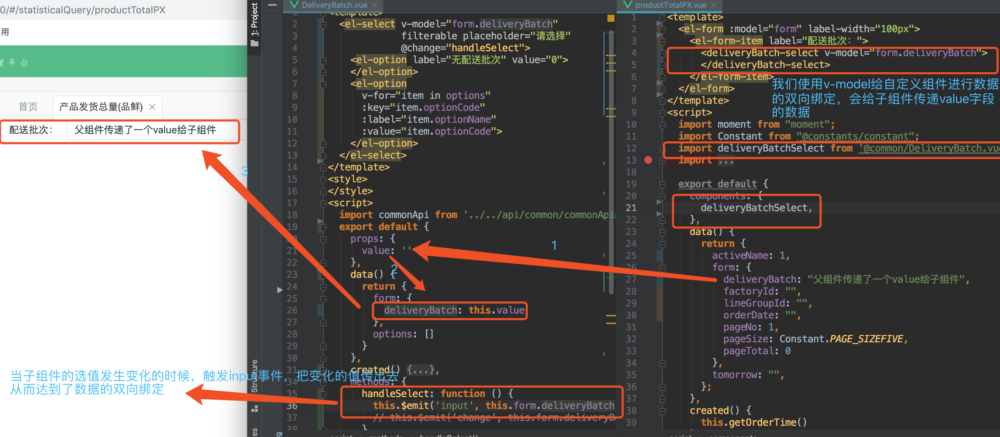
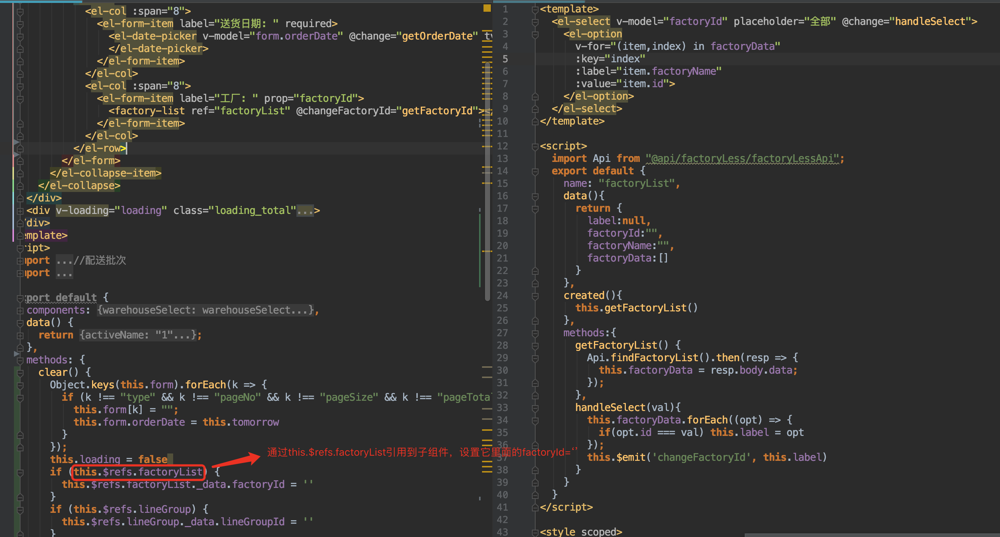

# 更新`vue`新语法和属性
## `vue` 简单介绍
 `Vue` 最大的特点是数据的双向绑定类似于`MVVM`，不仅可以把数据绑定到 `DOM` 文本或者特性`(this.msg=xx)`；还能绑定到 `DOM` 结构，通过指令 `v-if`，`v-show`，`v-for`，来进行 `DOM` 结构的显示隐藏切换，`DOM` 的结构渲染。
 
 `v-for` 指令，可以是 `computed` 计算属性或者 `methods` 里面可传递参数的方法。
 
 数据属性响应是变化是有前提条件的，数据定义在是在 `data`，`computed`，`props` 里面数据才会响应式变化其他地方不会。
 而且她们三个里面定义的字段不能重复，优先级是 `props` 优先级 > `data` 优先级 > `computed` 优先级>`methods`优先级,如果没有定义字段名，而直接在项目中使用会报错的。
 可以尝试在开发工具中打开看看，例如
 ；
 如果数据没有定义在 `data`，`computed`，`props` 里面，我们又想响应式变化，那就要借助全局 `api Vue.set(target,propertyName/index,value)`，如果是数组就用可以引起数组异的方法`（pop,push,shift)`等等
 
 
 在 `vue` 创建的项目中，所有 `Vue` 组件都是 `Vue` 实例（实例是由一个构造函数创建的，即都是 `new Vue（）`）
 
 
 使用 `Vue`，我们更新数据或者执行方法，所有的DOM操作，都由Vue来处理，我们编写的代码只需要关注逻辑层面即可
 
 组件系统是 `Vue` 的另一个重要概念，允许我们使用小型，独立和通常可复用的组件构建大型应用，几乎任意类型的应用界面都可以抽象为一个组件树`（element ui）`

## 新增属性 `2.6`新增   动态参数
` <a :[attributeName]=‘url’>内容</a>` 当 `attributeName` 是 `href` 的时候，就相当于 `<a :href=‘url’>内容</a>`，值得注意的是`attributeName` 会被作为一个 `JavaScript` 表达式进行动态求值，空格和引号会被忽视，@方法同样也适用动态参数
## 自定义组件使用 `v-model`

`v-model` 作用在`input`，`textarea`，`select`元素上创建双向数据绑定，会忽略`value`，`ckecked`，`selected`的特性。这个不过是一个语法糖，在自定义组件上面也可以使用`v-model`
    
  1. `text` 和 `textarea` 元素使用 `value` 属性和 `input` 事件；
    
  2. `checkbox` 和 `radio` 使用 `checked` 属性和 `change` 事件；
    
  3. `select` 字段将 `value` 作为 `prop` 并将 `change` 作为事件。
    
### 自定义组件使用 `v-model` 的一种场景

多个页面用到了同一个下下拉框，需要抽象出来写成公共组件，避免一个页面写一个，优点是便于维护

`v-model`,不过是一个语法糖，这段代码相当于`<input v-model=‘searchText’>`，是等价于
`<input :value = ‘searchText‘  @input=“searchText=$event.target.value”/>`

当我们在自定义组件上面使用 `v-model` 的时候，会像子组件传递一个 `value` 字段，同时触发一个 `@input=“$emit(‘input’,$event.target.value)`。


如果需求要求自定义组件为空的时候，要求子组件也要变化为空，我们用 `watch`  实时监听，当传入的值是空的时候，子组件也是空
```
watch: {
  'value' (val) {
    if (!val) {
      this.form.deliveryBatch = ''
    } else {
      this.form.deliveryBatch = val
    }
  }
}
```

如果我们不使用 `v-model` 也是可以的，那我们就要借助 `this.$refs` 引用到子组件



两个对比发现使用 `v-model` 代码量相对而言要精简很多，`this.$refs` 有一个缺陷就是初始渲染的时候访问不到他，他是作为渲染结果被创建的


## 传递入静态或者动态 `prop`
   1.传入布尔值
     <!-- 包含该 `prop` 没有值的情况在内，都意味着 ``true``。-->
		`<blog-post is-published></blog-post>`
		<!-- 即便 `false` 是静态的，我们仍然需要 `v-bind` 来告诉 Vue -->
		<!-- 这是一个 JavaScript 表达式而不是一个字符串。-->
		`<blog-post v-bind:is-published="false"></blog-post>`
	
   2.在 `javascript` 中，对象和数组是通过引入传入的，所以对于一个数组或者对象类型的 `prop` 来说，在子组件中改变这个对象或数组本身将会影响到父组件。我们为了避免这种情况，通常是深拷贝一个数组或者对象，传递给子组件
